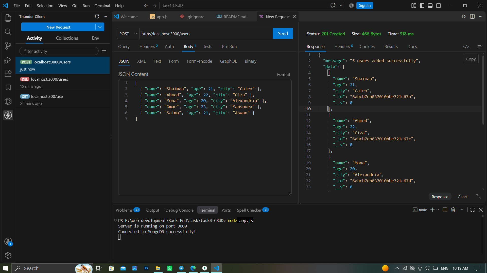
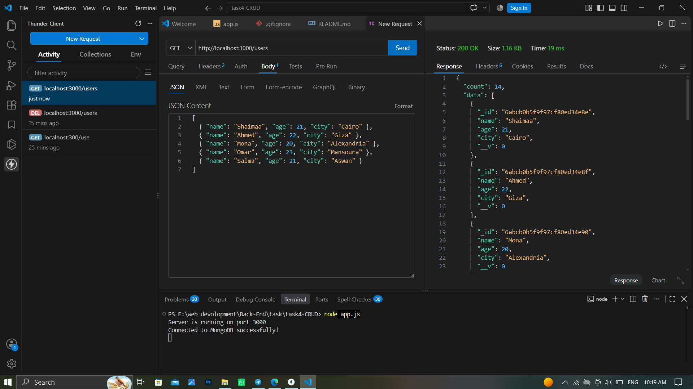
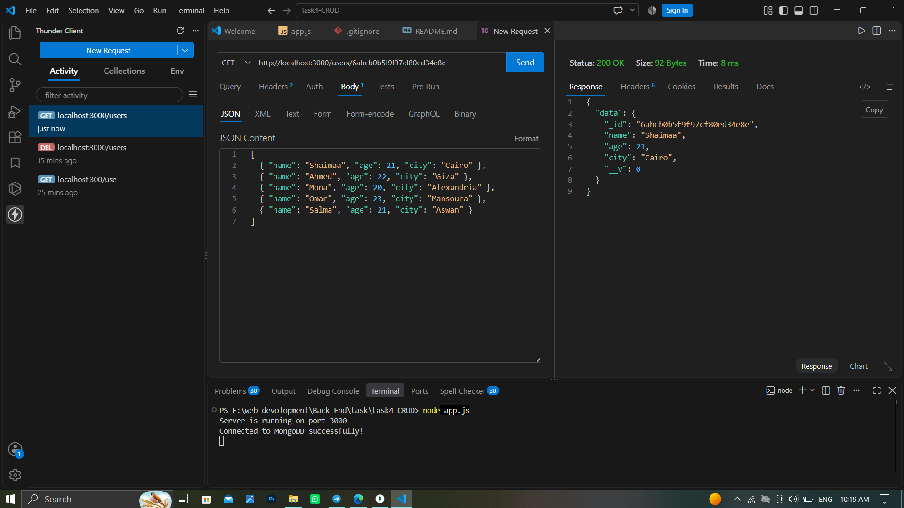
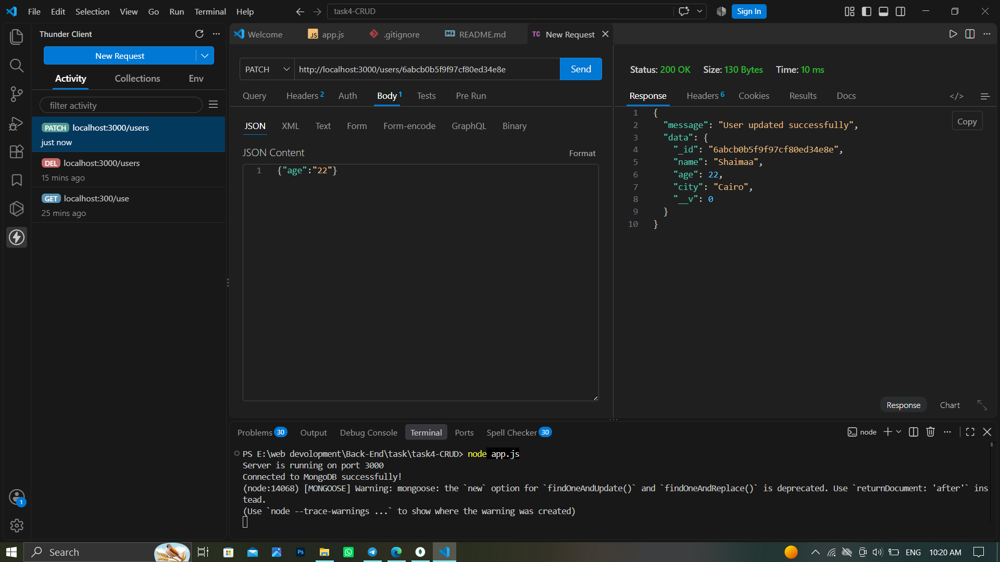
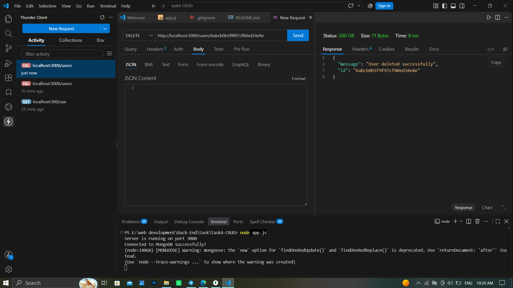

E.md
# Task 4: Node.js, Express, and MongoDB CRUD API

مشروع API متكامل لتطبيق نظام إدارة مستخدمين (Users Management System) باستخدام الـ Node.js, Express, and Mongoose.

## 🚀 Endpoints المتاحة:
- POST /users: لإدخال مجموعة مستخدمين دفعة واحدة (Bulk Insert).
- GET /users: لجلب جميع المستخدمين المسجلين.
- GET /users/:id: لجلب مستخدم محدد بواسطة الـ ID الخاص به.
- PATCH /users/:id: لتعديل بيانات مستخدم محدد.
- DELETE /users/:id: لحذف مستخدم محدد بواسطة الـ ID.

---
## لقطات شاشة لاختبارات الـ API (Thunder Client):

